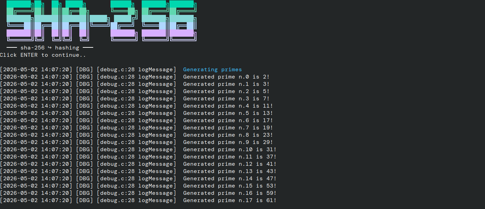
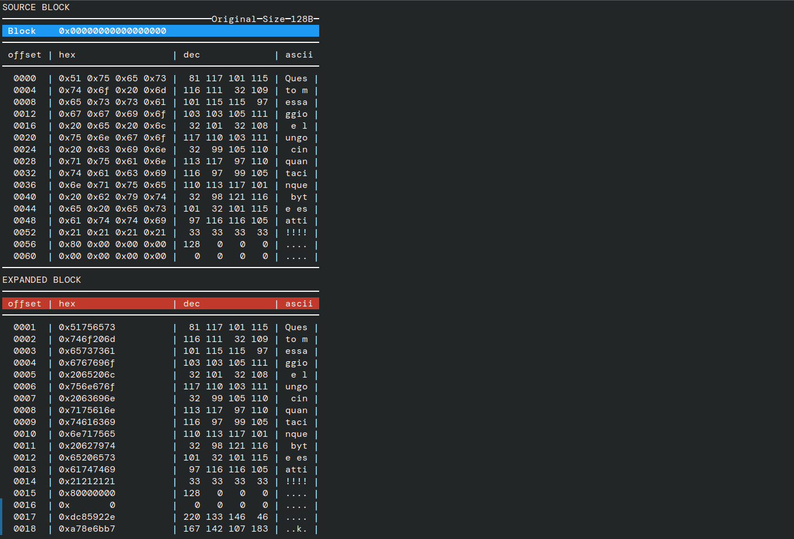
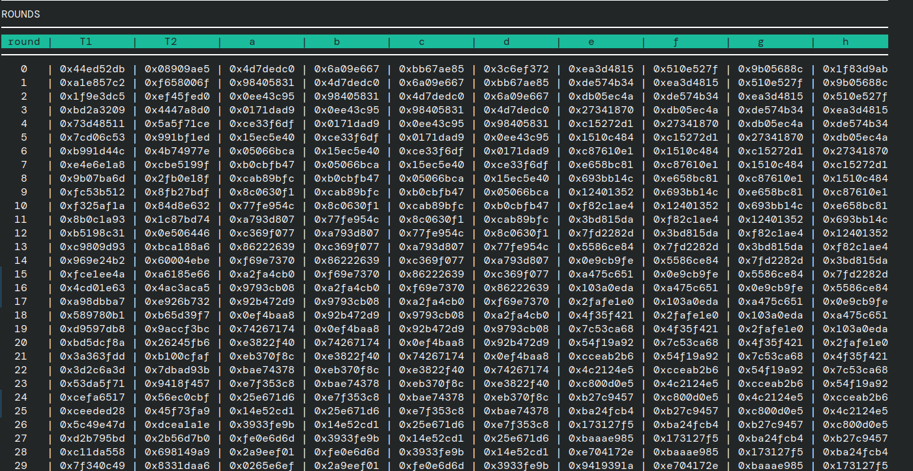

# SHA-256


A C implementation of the SHA-256 hashing algorithm, developed by the NSA and standardized by NIST in 2001. Built as a learning exercise to study how hashing functions work internally.

> **Not for production use**
> This is a study project. Feel free to copy, edit, or learn from it.

> **Dependency note**
> This software uses GCC built-in functions and requires GCC to compile.

---

## Compiling

```bash
make
```

## Usage

```bash
./sha256 "Hello world!"
# c0535e4be2b79ffd93291305436bf889314e4a3faec05ecffcbb7df31ad9e51a
```

## Interactive debugging

Compile with debug mode enabled:

```bash
make DEBUG=1
```

The interactive shell shows each step of the algorithm:



**Each block — original and expanded:**



**Compression rounds:**



---

## Testing

## Docs

Here you can see the original NIST [paper](docs/nist.fips.180-4.pdf)

## License

Distributed under the [GPL-2.0 License](https://www.gnu.org/licenses/old-licenses/gpl-2.0.html).