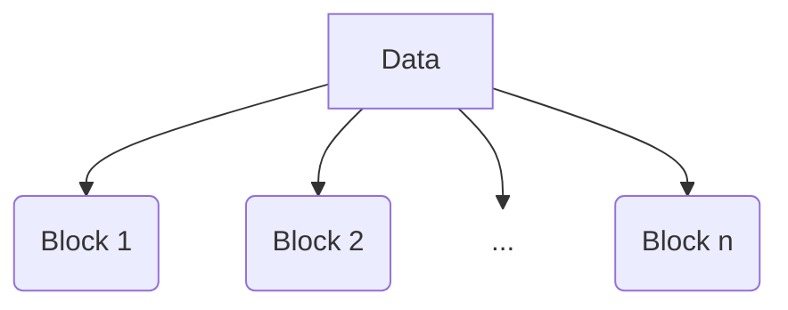

# Sha-256

## What is? 
First of all let's see to what it's the use of `sha256`: it's a hash algorithm to ensure integrity of data, developed by NSA.

## How it works
### The message
The mechanic is simple:

Let's take a data source, that we'll call `D`, with a length in `m` bytes.

$$ length(D) = mBytes $$

### Blocks

So, we have to split this message in `n` units, that we call `B` (Block). A block is composed by 512bit (64 bytes)

$$ length(B_n) = 64Bytes = 512 bits $$

### Padding

If the message isn't a multiple of 64 bytes (512 bits), we'll padding it and, in case there is no space for additional 9 bytes (1 byte for bit termination bit and length in 8 bytes) we'll have n + 1 blocks.

In fact at the end of the original message we'll append 1 bit as 1 - _0x80 for a byte in hexadecimal_ - and we'll fill of zero until the last 8 bytes,
in which write, as an integer of 64 bits, the length of the message.

This is an example of "Hello world!" string.
In the first 12 bytes we have the corresponding bytes. 
At the position 13, in green, we have the bit 1.
At the end, in orange, the length expressed in bits (96 un decimal, 0x60 in hex):

#### Message
$$
\left|
\begin{array}{cccccccccccccccc}
\texttt{0x48} & \texttt{0x65} & \texttt{0x6C} & \texttt{0x6C} &
\texttt{0x6F} & \texttt{0x20} & \texttt{0x77} & \texttt{0x6F} &
\texttt{0x72} & \texttt{0x6C} & \texttt{0x64} & \texttt{0x21} 
\end{array}
\right|
$$

#### Padded Block

$$
\left|
\begin{array}{cccccccccccccccc}
\textcolor{cyan}{\texttt{0x48}} & \textcolor{cyan}{\texttt{0x65}} & \textcolor{cyan}{\texttt{0x6C}} & \textcolor{cyan}{\texttt{0x6C}} &
\textcolor{cyan}{\texttt{0x6F}} & \textcolor{cyan}{\texttt{0x20}} & \textcolor{cyan}{\texttt{0x77}} & \textcolor{cyan}{\texttt{0x6F}} &
\textcolor{cyan}{\texttt{0x72}} & \textcolor{cyan}{\texttt{0x6C}} & \textcolor{cyan}{\texttt{0x64}} & \textcolor{cyan}{\texttt{0x21}} &
\textcolor{lime}{\texttt{0x80}} & \texttt{0x00} & \texttt{0x00} & \texttt{0x00} \\
\texttt{0x00} & \texttt{0x00} & \texttt{0x00} & \texttt{0x00} &
\texttt{0x00} & \texttt{0x00} & \texttt{0x00} & \texttt{0x00} &
\texttt{0x00} & \texttt{0x00} & \texttt{0x00} & \texttt{0x00} &
\texttt{0x00} & \texttt{0x00} & \texttt{0x00} & \texttt{0x00} \\
\texttt{0x00} & \texttt{0x00} & \texttt{0x00} & \texttt{0x00} &
\texttt{0x00} & \texttt{0x00} & \texttt{0x00} & \texttt{0x00} &
\texttt{0x00} & \texttt{0x00} & \texttt{0x00} & \texttt{0x00} & 
\texttt{0x00} & \texttt{0x00} & \texttt{0x00} & \texttt{0x00}\\
\texttt{0x00} & \texttt{0x00} & \texttt{0x00} & \texttt{0x00} & 
\texttt{0x00} & \texttt{0x00} & \texttt{0x00} & \texttt{0x00} &
\textcolor{orange}{\texttt{0x00}} & \textcolor{orange}{\texttt{0x00}} & \textcolor{orange}{\texttt{0x00}} & \textcolor{orange}{\texttt{0x00}} &
\textcolor{orange}{\texttt{0x00}} & \textcolor{orange}{\texttt{0x00}} & \textcolor{orange}{\texttt{0x00}} & \textcolor{orange}{\texttt{0x60}}
\end{array}
\right|
$$

### Constats

